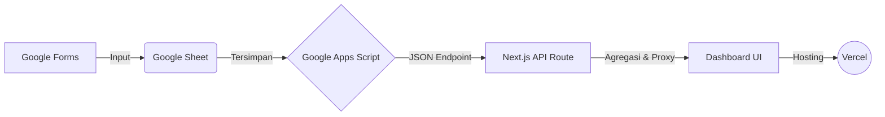

# 🏥 Dashboard Patroli Kesling & K3 RSOMH

Dashboard web responsif untuk memonitor kepatuhan **17 topik patroli** Kesehatan Lingkungan dan K3 di Rumah Sakit Otak Muhammad Hatta (RSOMH). Dokumen ini berfungsi sebagai **Manual Book** terpadu untuk Pengguna (User), Administrator (Admin), dan Tim IT (Developer).

---

## 📖 BUKU PANDUAN PENGGUNA (USER MANUAL)

Panduan ini ditujukan bagi pimpinan, staf K3, atau pengguna umum yang ingin melihat dan menganalisis hasil patroli K3.

### 1. Navigasi & Filter Dashboard
- **Halaman Utama (Ringkasan):** Menampilkan rata-rata kepatuhan semua 17 modul. Anda bisa melihat tren bulanan secara garis besar.
- **Menu Samping (Sidebar):** Klik salah satu dari 17 topik (misal: APD, APAR, PCRA, B3, dll) untuk melihat detail spesifik dari topik tersebut.
- **Filter Data:** Di bagian atas setiap halaman, terdapat dropdown filter:
  - **Bulan:** Pilih bulan laporan yang ingin dilihat.
  - **Ruangan:** (Opsional) Pilih ruangan/lokasi spesifik untuk mengerucutkan data.

### 2. Membaca Indikator Warna (Threshold)
Sistem menggunakan warna untuk memudahkan identifikasi status kepatuhan:
- 🟢 **Hijau (≥ 90%)**: Patuh & Aman.
- 🟡 **Kuning (70% - 89%)**: Peringatan, Perlu Perbaikan.
- 🔴 **Merah (< 70%)**: Tidak Patuh & Bahaya, butuh tindakan segera.

### 3. Membaca Grafik dan Tabel Detail
Sistem secara otomatis menghitung tingkat kepatuhan secara presisi:
- **Grafik Setengah Lingkaran (Gauge):** Menunjukkan rata-rata persentase kepatuhan topik secara keseluruhan pada bulan yang dipilih.
- **Kepatuhan Per Pertanyaan:** Menunjukkan indikator mana yang paling lemah/sering dilanggar.
- **Tabel Laporan Detail:** Menampilkan data baris-per-baris untuk setiap ruangan dan setiap jadwal patroli. Khusus untuk topik kompleks (seperti APD atau B3), terdapat *Tab* (opsi a, b, c) di atas tabel untuk melihat aspek yang berbeda (contoh: *Ketersediaan* vs *Kepatuhan Penggunaan*).

### 4. Menggunakan Fitur AI Summary (Ringkasan Cerdas)
- Di bagian atas dashboard atau halaman detail, klik tombol **"✨ Buat Ringkasan AI"**.
- AI akan membaca semua data temuan, angka kepatuhan, dan catatan lapangan, lalu membuatkan rangkuman otomatis.
- **Instruksi Tambahan:** Setelah ringkasan muncul, Anda bisa mengetik permintaan khusus (misal: *"Tolong fokuskan ringkasan pada masalah di UGD"*) dan klik **Perbarui Ringkasan**.

### 5. Export Laporan ke Excel
- Di halaman detail topik, klik tombol **"📥 Export Excel"**.
- Sistem akan otomatis mengunduh file `.xlsx` yang berisi rekapitulasi data. Jika Anda mengunduh Ringkasan Utama, rumus dan cara perhitungan akan otomatis tercetak rapi di bagian bawah tabel sebagai panduan.

---

## ⚙️ BUKU PANDUAN ADMIN (ADMIN MANUAL)

Panduan ini ditujukan bagi Admin K3 yang bertugas mengelola master data, membuat topik proyek PCRA, dan menjaga struktur Google Form.

### 1. Manajemen Master Data (Ruangan & Unit Profesi)
Master Data sangat vital karena digunakan sebagai **acuan dasar penyebut (denominator)** untuk menghitung persentase kepatuhan (seperti standar jumlah pegawai, jumlah APAR, atau jumlah lemari B3).
- **Akses:** Klik menu **"Admin Master Data"** (ikon gerigi) di pojok kiri bawah menu samping.
- **Login:** Masukkan kata sandi admin (secara bawaan adalah `rahasia_rsomh_k3`).
- **Kelola Ruangan:** Anda dapat menambah, mengedit, atau menonaktifkan ruangan. **Perhatian:** Tombol *Hapus* sengaja ditiadakan. Hal ini bertujuan agar sejarah data (history) bulan-bulan sebelumnya tidak rusak apabila ada ruangan yang sudah tidak aktif.
- **Kelola Unit Profesi Khusus:** Untuk modul APD, Anda dapat menambah profesi spesifik (seperti Dokter, Perawat, dll) menggunakan tombol khusus **"+ Tambah Profesi"**. Sistem akan otomatis menambahkan tanda `**` di depannya untuk membedakan antara Ruangan fisik dan Unit Profesi.

### 2. Manajemen Topik PCRA (Proyek Konstruksi)
Khusus untuk modul PCRA, Admin dapat membuat daftar proyek renovasi/pembangunan.
- **Akses:** Buka menu **PCRA** dari sidebar.
- **Login:** Klik tombol **"Kelola Topik PCRA"**, lalu masukkan kata sandi (`rahasia_rsomh_k3`).
- **Kelola Proyek:** Anda bisa membuat proyek baru, menentukan tanggal mulai-selesai, dan memilih lokasi-lokasi yang terdampak proyek tersebut.
- Topik yang Anda buat akan langsung muncul sebagai opsi tab di dashboard PCRA.

### 3. Aturan Ketat Mengedit Google Form (Sangat Penting ⚠️)
Dashboard membaca data berdasarkan struktur dan nama pertanyaan di Google Form. Ikuti aturan ini agar sistem tidak *error*:
- **JANGAN Mengubah Teks Pertanyaan:** Jika form sudah berjalan, jangan ubah kalimat pertanyaan secara sembarangan (misal: *"Lokasi Temuan"* diubah menjadi *"Dimana lokasi temuan?"*). Ini akan merusak pemetaan kolom di Google Sheet!
- **JANGAN Menggunakan Tipe "Grid":** Hindari tipe pertanyaan *Pilihan Ganda Grid* atau *Kotak Centang Grid* karena susunannya rumit. Gunakan Dropdown, Pilihan Ganda biasa, atau Jawaban Singkat.
- **Menambah/Menghapus Pertanyaan:** Jika harus menambah/menghapus, hal tersebut memerlukan pembaruan kode (coding) oleh IT pada Google Apps Script dan *frontend* aplikasi agar sistem mengenali kolom yang baru.

### 4. Panduan Serah Terima (Handover) ke Pihak RSOMH
1. **Email Institusi:** Gunakan akun resmi (misal: `k3.rsomh@gmail.com`).
2. **Transfer Ownership:** Jadikan email tersebut sebagai *Owner* dari file Google Form dan Google Sheet.
3. **Deploy Ulang Apps Script:** Buka Google Sheet via email institusi > Klik **Ekstensi** > **Apps Script** > **Deploy** > **New Deployment** (Web App) > Execute as: *Me*.
4. **API Key Baru:** Buat API Key Gemini di Google AI Studio menggunakan email institusi.
5. **Update Hosting:** Masukkan URL Web App dan API Key yang baru ke *Environment Variables* di platform hosting.

---

## 💻 DOKUMENTASI TEKNIS & DEVELOPER

Bagian ini khusus untuk tim IT/Developer yang ingin mengembangkan atau melakukan *maintenance* aplikasi tingkat lanjut.

### Arsitektur Sistem


### Persiapan & Instalasi Lokal
1. **Kloning & Install Dependencies:**
   ```bash
   npm install
   ```
2. **Environment Variables:** Buat file `.env.local` di *root directory* proyek:
   ```env
   GOOGLE_SHEETS_WEBAPP_URL=https://script.google.com/...
   GEMINI_API_KEY=AIzaSy...
   CRUD_SECRET=rahasia_rsomh_k3
   ```
3. **Jalankan Server Development:**
   ```bash
   npm run dev
   ```
   Buka [http://localhost:3000](http://localhost:3000)

### API Routes & Manajemen Cache
- **Keamanan Proxy:** Seluruh penarikan data ke Google dilakukan via server-side API Routes (`/api/master`, `/api/patrol-data`). Kunci rahasia seperti `CRUD_SECRET` tervalidasi menggunakan Next.js Server Actions dan tidak terekspos ke sisi klien (browser).
- **Efisiensi Pengambilan Data:** Pengambilan data paralel diproses menggunakan `Promise.allSettled` agar error di satu data tidak membatalkan keseluruhan *render* halaman.
- **Cache Invalidation:** Manajemen *cache* memori (60 detik TTL) diatur di dalam `lib/google-sheets.ts` untuk menghindari rate-limit Google. 
- Operasi CRUD (Tambah/Edit) di endpoint `/api/master` akan otomatis memanggil `invalidateMasterCache()`, dan _fetch cache_ HTTP telah di-set ke `no-store`, sehingga data terbaru akan langsung tersaji (0 detik delay).

### Troubleshooting Server
| Masalah / Error | Kemungkinan Penyebab | Solusi |
|-----------------|----------------------|--------|
| `GOOGLE_SHEETS_WEBAPP_URL is not set` | Environment variable belum dikonfigurasi. | Pastikan file `.env.local` sudah dibuat beserta variabelnya. |
| `Web App returned HTTP 403` | Script tidak diizinkan untuk diakses publik. | Masuk ke Apps Script, lalu redeploy sebagai "Web App" dengan akses **"Anyone"**. |
| Data di Dashboard Kosong | Tidak ada data di bulan tersebut, atau header Form berubah. | Periksa apakah ada pengisian di bulan yang dipilih, serta pastikan nama header kolom di Sheet tidak berubah. |
