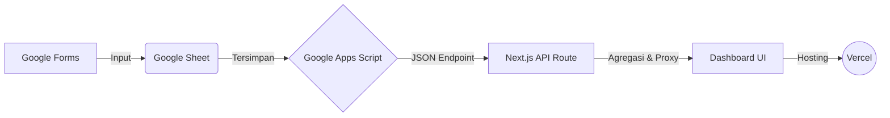

# 🏥 Dashboard Patroli Kesling & K3 RSOMH


Dashboard web responsif untuk memonitor kepatuhan **17 topik patroli** Kesehatan Lingkungan dan K3 di Rumah Sakit Otak Muhammad Hatta (RSOMH) Bukittinggi. 

Dokumen ini berfungsi sebagai **Manual Book** terpadu untuk Pengguna (User), Administrator (Admin), dan Tim IT (Developer).

---

## 🌟 Fitur Utama

- 📊 **Visualisasi Data Interaktif**: Grafik gauge, diagram batang, dan tabel analisis kepatuhan per ruangan dan topik.
- 🤖 **Ringkasan Cerdas (AI Summary)**: Integrasi dengan Google Gemini AI untuk menganalisis temuan dan memberikan kesimpulan/rekomendasi otomatis.
- 📥 **Export Laporan (Excel & PDF)**: Mengunduh data hasil patroli secara rapi dan terstruktur dalam format `.xlsx` dan `.pdf`.
- 🏢 **Manajemen Master Data & PCRA**: Admin dapat mengelola daftar ruangan, unit profesi, dan memonitor proyek konstruksi (PCRA).
- 🔒 **Kunci Bulan (Lock Month)**: Fitur bagi Admin untuk mengunci data patroli pada bulan tertentu agar tidak bisa diubah lagi.
- ⚡ **Kinerja Tinggi & Caching Cerdas**: Dilengkapi dengan *AbortController* untuk mencegah *race condition* saat perpindahan tab secara cepat, dan mekanisme *request deduplication* untuk mencegah *rate-limit* Google Apps Script.

---

## 🔗 Akses & Link Penting

- **Formulir Isi Patroli K3RS:** [Isi Form Disini](https://forms.gle/C9YZAJLHjAZMdnHY8)
- **Edit Google Form:** [Mode Editor Form](https://docs.google.com/forms/d/1aGG59GOZLQ7IGG6Jc1BakbETd8TgXkc-RaSqPI67Igc/edit#responses)
- **Spreadsheet Data Mentah:** [Google Sheets Data](https://docs.google.com/spreadsheets/d/1cX0s-kW_fiGwmN5QQNSww3o2tiG3UK1_CeADJXIC5Ys/edit?usp=sharing)
- **Menu Pengaturan / Master Data:** Anda bisa mengatur tautan di atas melalui halaman **Pengaturan** di dashboard. Sandi default untuk mengubah Form Link adalah `k3rs`.

---

## 🚀 Teknologi yang Digunakan (Tech Stack)

### Frontend & UI
- **Framework**: [Next.js 14](https://nextjs.org/) (App Router)
- **Library**: [React 18](https://react.dev/)
- **Styling**: [Tailwind CSS](https://tailwindcss.com/)
- **Ikon**: [Lucide React](https://lucide.dev/)
- **Grafik**: [Recharts](https://recharts.org/)

### Backend & Database
- **API**: Next.js API Routes (Serverless)
- **Database Utama**: Google Sheets
- **Penghubung Data**: Google Apps Script (menghasilkan JSON Endpoint)
- **AI Engine**: Google Gemini API

### Utilitas (Utilities)
- **Manipulasi Tanggal**: `date-fns`
- **Export Data**: `exceljs`, `jspdf`, `jspdf-autotable`, `html2canvas`

---

## 📖 BUKU PANDUAN PENGGUNA (USER MANUAL)

Panduan ini ditujukan bagi pimpinan, staf K3, atau pengguna umum yang ingin melihat dan menganalisis hasil patroli K3.

### 1. Navigasi & Filter Dashboard
- **Halaman Utama (Ringkasan):** Menampilkan rata-rata kepatuhan semua 17 modul. Anda bisa melihat tren bulanan secara garis besar.
- **Menu Samping (Sidebar):** Klik salah satu dari 17 topik (misal: APD, APAR, PCRA, B3, dll) untuk melihat detail spesifik dari topik tersebut.
- **Filter Data:** Di bagian atas setiap halaman, terdapat dropdown filter:
  - **Bulan:** Pilih bulan laporan yang ingin dilihat.
  - **Ruangan:** (Opsional) Pilih ruangan/lokasi spesifik untuk mengerucutkan data.

### 2. Membaca Indikator Warna (Threshold)
Sistem menggunakan warna untuk memudahkan identifikasi status kepatuhan:
- 🟢 **Hijau (≥ 90%)**: Patuh & Aman.
- 🟡 **Kuning (70% - 89%)**: Peringatan, Perlu Perbaikan.
- 🔴 **Merah (< 70%)**: Tidak Patuh & Bahaya, butuh tindakan segera.

### 3. Membaca Grafik dan Tabel Detail
Sistem secara otomatis menghitung tingkat kepatuhan secara presisi:
- **Grafik Setengah Lingkaran (Gauge):** Menunjukkan rata-rata persentase kepatuhan topik secara keseluruhan pada bulan yang dipilih.
- **Kepatuhan Per Pertanyaan:** Menunjukkan indikator mana yang paling lemah/sering dilanggar dalam bentuk diagram batang/bar.
- **Tabel Laporan Detail:** Menampilkan data baris-per-baris untuk setiap ruangan dan setiap jadwal patroli. Khusus untuk topik kompleks (seperti APD atau B3), terdapat *Tab* (opsi a, b, c) di atas tabel untuk melihat aspek yang berbeda (contoh: *Ketersediaan* vs *Kepatuhan Penggunaan*).
- **Logika Khusus APD (Karyawan):** Jika temuan dijawab "Tidak" (ada pelanggaran) namun tidak ada keterangan profesi/unit yang melanggar, sistem secara default hanya akan mengurangi **1** dari total karyawan sebagai asumsi minimal pelanggaran. Jika dijawab "Ya", kepatuhan otomatis 100% tanpa potongan.

### 4. Menggunakan Fitur AI Summary (Ringkasan Cerdas)
- Di bagian atas dashboard atau halaman detail, klik tombol **"✨ Buat Ringkasan AI"**.
- AI akan membaca semua data temuan, angka kepatuhan, dan catatan lapangan, lalu membuatkan rangkuman otomatis.
- **Instruksi Tambahan:** Setelah ringkasan muncul, Anda bisa mengetik permintaan khusus di kolom yang tersedia (misal: *"Tolong fokuskan ringkasan pada masalah di IGD"*) dan klik **Perbarui Ringkasan**.

### 5. Export Laporan (Excel & PDF)
- Di halaman detail topik, klik tombol **"📥 Export Excel"** atau **"📄 Export PDF"**.
- **Excel (`.xlsx`)**: Sistem akan mengunduh file spreadsheet berisi rekapitulasi data. Jika mengunduh Ringkasan Utama, rumus dan cara perhitungan akan tercetak rapi di bagian bawah tabel sebagai panduan.
- **PDF**: Halaman akan dirender menjadi format dokumen siap cetak.

---

## ⚙️ BUKU PANDUAN ADMIN (ADMIN MANUAL)

Panduan ini ditujukan bagi Admin K3 yang bertugas mengelola master data, membuat topik proyek PCRA, mengunci bulan, dan menjaga struktur Google Form.

### 1. Manajemen Master Data (Ruangan & Unit Profesi)
Master Data sangat vital karena digunakan sebagai **acuan dasar penyebut (denominator)** untuk menghitung persentase kepatuhan (seperti standar jumlah pegawai, jumlah APAR, atau jumlah lemari B3).
- **Akses:** Klik menu **"Admin Master Data"** (ikon gerigi) di pojok kiri bawah menu samping.
- **Login:** Masukkan kata sandi admin (secara bawaan adalah `rahasia_rsomh_k3`).
- **Kelola Ruangan:** Anda dapat menambah, mengedit, atau menonaktifkan ruangan. **Perhatian:** Tombol *Hapus* sengaja ditiadakan. Hal ini bertujuan agar sejarah data (history) bulan-bulan sebelumnya tidak rusak apabila ada ruangan yang sudah tidak aktif.
- **Kelola Unit Profesi Khusus:** Untuk modul APD, Anda dapat menambah profesi spesifik (seperti Dokter, Perawat, dll) menggunakan tombol khusus **"+ Tambah Profesi"**. Sistem akan otomatis menambahkan tanda `**` di depannya untuk membedakan antara Ruangan fisik dan Unit Profesi.

### 2. Manajemen Topik PCRA (Proyek Konstruksi)
Khusus untuk modul PCRA, Admin dapat membuat daftar proyek renovasi/pembangunan.
- **Akses:** Buka menu **PCRA** dari sidebar.
- **Login:** Klik tombol **"Kelola Topik PCRA"**, lalu masukkan kata sandi admin (`rahasia_rsomh_k3`).
- **Kelola Proyek:** Anda bisa membuat proyek baru, menentukan tanggal mulai-selesai, dan memilih lokasi-lokasi yang terdampak proyek tersebut.
- Topik yang Anda buat akan langsung muncul sebagai opsi tab di dashboard PCRA.

### 3. Kunci Bulan (Lock Month)
- Admin dapat mengunci data bulan tertentu agar tidak berubah meskipun ada data yang telat masuk ke Google Form/Sheet.
- Fitur ini sangat berguna untuk keperluan pelaporan bulanan final.

### 4. Aturan Ketat Mengedit Google Form (Sangat Penting ⚠️)
Dashboard membaca data berdasarkan struktur dan nama pertanyaan di Google Form. Ikuti aturan ini agar sistem tidak *error*:
- **JANGAN Mengubah Teks Pertanyaan:** Jika form sudah berjalan, jangan ubah kalimat pertanyaan secara sembarangan (misal: *"Lokasi Temuan"* diubah menjadi *"Dimana lokasi temuan?"*). Ini akan merusak pemetaan kolom di Google Sheet!
- **JANGAN Menggunakan Tipe "Grid":** Hindari tipe pertanyaan *Pilihan Ganda Grid* atau *Kotak Centang Grid* karena susunannya rumit. Gunakan Dropdown, Pilihan Ganda biasa, atau Jawaban Singkat.
- **Menambah/Menghapus Pertanyaan:** Jika harus menambah/menghapus, hal tersebut memerlukan pembaruan kode (coding) oleh IT pada Google Apps Script dan *frontend* aplikasi agar sistem mengenali kolom yang baru.

### 5. Panduan Serah Terima (Handover) ke Pihak RSOMH
1. **Email Institusi:** Gunakan akun resmi (misal: `k3.rsomh@gmail.com`).
2. **Transfer Ownership:** Jadikan email tersebut sebagai *Owner* dari file Google Form dan Google Sheet.
3. **Deploy Ulang Apps Script:** Buka Google Sheet via email institusi > Klik **Ekstensi** > **Apps Script** > **Deploy** > **New Deployment** (Web App) > Execute as: *Me* > Who has access: *Anyone*.
4. **API Key Baru:** Buat API Key Gemini di [Google AI Studio](https://aistudio.google.com/) menggunakan email institusi.
5. **Update Hosting:** Masukkan URL Web App Apps Script dan API Key yang baru ke *Environment Variables* di platform hosting (misal: Vercel).

---

## 💻 DOKUMENTASI TEKNIS & DEVELOPER

Bagian ini khusus untuk tim IT/Developer yang ingin mengembangkan atau melakukan *maintenance* aplikasi tingkat lanjut.

### 🏗️ Arsitektur Sistem


### 📂 Struktur Direktori Utama
```text
dashboard-safety-patrol-k3/
├── app/               # Next.js App Router (Halaman, API Routes)
├── components/        # Komponen React (UI, Charts, Modals)
├── lib/               # Fungsi Utilitas (Google Sheets fetcher, dll)
├── public/            # Aset statis (Gambar, Font)
├── package.json       # Dependencies dan script
└── tailwind.config.js # Konfigurasi Tailwind CSS
```

### 🛠️ Persiapan & Instalasi Lokal

1. **Prasyarat (Prerequisites):**
   - Node.js (v18.17 atau lebih baru disarankan)
   - npm, yarn, pnpm, atau bun

2. **Kloning Repositori:**
   ```bash
   git clone <url-repo-anda>
   cd dashboard-safety-patrol-k3
   ```

3. **Install Dependencies:**
   ```bash
   npm install
   ```

4. **Environment Variables:** 
   Buat file `.env.local` di *root directory* proyek dan isi dengan variabel berikut:
   ```env
   # URL Endpoint JSON dari Google Apps Script
   GOOGLE_SHEETS_WEBAPP_URL=https://script.google.com/macros/s/.../exec
   
   # API Key untuk fitur AI Summary
   GEMINI_API_KEY=AIzaSy...
   
   # Kata sandi admin untuk mengakses Master Data & PCRA
   CRUD_SECRET=rahasia_rsomh_k3
   
   # Kata sandi pengaturan link edit form (hardcoded di pengaturan)
   # Password: k3rs
   ```

5. **Jalankan Server Development:**
   ```bash
   npm run dev
   ```
   Buka [http://localhost:3000](http://localhost:3000) di browser Anda untuk melihat hasilnya.

### 🌐 API Routes & Manajemen Cache
- **Keamanan Proxy:** Seluruh penarikan data ke Google dilakukan via server-side API Routes (`/api/master`, `/api/patrol-data`, `/api/lock-month`). Kunci rahasia seperti `CRUD_SECRET` tervalidasi menggunakan backend sehingga tidak terekspos ke sisi klien (browser).
- **Efisiensi Pengambilan Data:** Pengambilan data paralel diproses menggunakan `Promise.allSettled` agar *error* di satu data (misal: 1 module gagal dimuat) tidak membatalkan keseluruhan *render* halaman (Fault Tolerance). Dilengkapi *in-flight deduplication* untuk mencegah pemanggilan berulang ke Google Sheet dalam waktu bersamaan.
- **Cache Invalidation:** Manajemen *cache* memori (120-300 detik TTL) diatur di dalam `lib/google-sheets.ts` untuk menghindari *rate-limit* Google Apps Script dan mempercepat muat ulang. 
- Operasi CRUD (Tambah/Edit) di endpoint `/api/master` akan otomatis memanggil fungsi invalidasi *cache*, sehingga data terbaru akan langsung tersaji tanpa *delay*.
- **Pembatalan Request:** Modul dashboard memanfaatkan *AbortController* sehingga berpindah menu secara cepat tidak akan menimbulkan tabrakan *state* (State Race Condition).

### 🔧 Skrip NPM yang Tersedia
- `npm run dev`: Menjalankan aplikasi dalam mode *development*.
- `npm run build`: Membangun (build) aplikasi untuk *production*.
- `npm run start`: Menjalankan aplikasi hasil *build production*.
- `npm run lint`: Menjalankan pengecekan *linter* ESLint.

### 🐞 Troubleshooting Server & Error Handling
| Masalah / Error | Kemungkinan Penyebab | Solusi |
|-----------------|----------------------|--------|
| `GOOGLE_SHEETS_WEBAPP_URL is not set` | Environment variable belum dikonfigurasi. | Pastikan file `.env.local` sudah dibuat beserta variabelnya. Restart server `npm run dev` setelah membuat file. |
| `Web App returned HTTP 403` / `CORS Error` | Script Google tidak diizinkan untuk diakses publik. | Masuk ke Apps Script, lalu redeploy sebagai "Web App" dengan akses **"Anyone" (Siapa saja)**. |
| Data di Dashboard Kosong | Tidak ada data di bulan tersebut, atau header Form berubah. | Periksa apakah ada pengisian di bulan yang dipilih pada Google Sheets. Pastikan juga nama *header* kolom di Sheet sama persis dengan yang diharapkan kode. |
| Fitur AI Summary Error | `GEMINI_API_KEY` tidak valid atau limit API tercapai. | Periksa API Key di `.env.local`. Buat API Key baru jika perlu di Google AI Studio. |

---

> **Dikembangkan untuk RSOMH Bukittinggi - Bidang Kesehatan Lingkungan & K3**
